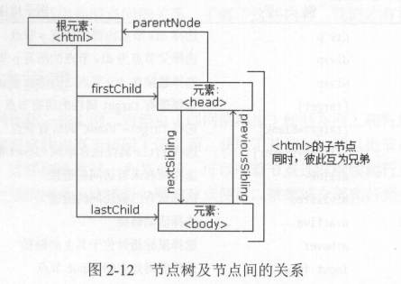

[TOC]

# WebSpider

爬虫学习笔记及代码

---


## 爬虫基础

### HTTP 基本原理

URL：Uniform Resource Identifier（统一资源标志符）

HTTP：Hyper Text Transfer Protocol（超文本传输协议）

HTTPS 加入 SSL 层加密数据

#### 请求

- 请求过程


- 请求方法：GET 和 POST

GET 请求中的参数包含在 URL 里面，数据可以在 URL 中看到，而 POST 请求的 URL 不会包含这些数据，数据都是通过表单形式传输的，会包含在**请求体**中。

- 请求头

请求头，用来说明服务器要使用的附加信息

Cookie ：也常用复数形式 Cookies ，这是网站为了辨别用户进行会话跟踪而存储在用户本地的数据。

Referer ：此内容用来标识这个请求是从哪个页面发过来的，服务器可以拿到这一信息并做相应的处理，如做来源统计、防盗链处理等。

User-Agent ：简称 UA ，它是一个特殊的字符串头，可以使服务器识别客户使用的操作系统及版本 、 浏览器及版本等信息。 在做爬虫时加上此信息，可以伪装为浏览器；如果不加，很可能会被识别为爬虫。

Content-Type ：也叫互联网媒体类型（ Internet Media Type ）或者 MIME 类型，在 HTTP 协议消息头中，它用来表示具体请求中的媒体类型信息。 

- 请求体

请求体－般承载的内容是 POST 请求中的表单数据

在爬虫中，如果要构造 POST 请求，需要使用正确的 Content-Type ，并了解各种请求库的各个参数设置时使用的是哪种 Content-Type，不然可能会导致 POST 提交后无法正常响应。

| Content-Type                       | 提交数据的方式   |
| ---------------------------------- | ---------------- |
| application/x-www-forrn-urlencoded | 表单数据         |
| multipart/form-data                | 表单文件上传     |
| application/json                   | 序列化 JSON 数据 |
| text/xml                           | XML 数据         |

#### 响应

响应，由服务端返回给客户端，可以分为三部分：响应状态码（ Response Status Code ）、响应头( Response Headers ）和响应体（ Response Body ）。

- 响应状态码

200：服务器正常响应

404：页面未找到

500：服务器内部发生错误

在爬虫中，我们可以**根据状态码来判断服务器响应状态**，如状态码为 200 ，则证明成功返回数据，再进行进一步的处理，否则直接忽略。

- 响应头

Content-Type ： 文档类型 ，指定返回的数据类型是什么 ，如 text/htm l 代表返回 HTML 文档，application/x-javascript 代表返回 JavaScript 文件， image/jpeg 则代表返回图片。

Set-Cookie：设置 Cookies。响应头 中的 Set-Cooki e 告诉浏览器需要将此内容放在 Cookies中，下次请求携带 Cookies 请求。

- 响应体

响应的正文数据都在响应体中，比如请求网页时，它的响应体就是网页的 HTML 代码；请求一张图片时，它的响应体就是图片的二进制数据。 

### 网页基础

#### 网页组成

HTML、CSS、JS

#### 网页结构

- 节点树及节点间的关系

在 HTML 中，所有标签定义的内容都是节点，它们构成了一个 HTML DOM 树。


通过 HTML DOM ，树中的所有节点均可通过 JavaScript 访问，所有 HTML 节点元素均可被修改，也可以被创建或删除 。节点树中的节点彼此拥有层级关系 。 我们常用父（ parent ）、子（ child ）和兄弟（ sibling ）等术语描述这些关系。父节点拥有子节点，同级的子节点被称为兄弟节点 。



- 选择器

在 css 中，我们使用 css 选择器来定位节点 。


### 爬虫概述

获取网页（urllib、requests）——>提取信息（Beautiful Soup 、 pyquery 、 lxml）——>保存数据（txt、json、数据库）——>自动化程序

用 urllib 或 requests 抓取网页时，得到的源代码实际和浏览器中看到的不一样，现在网页越来越多地采用 Ajax 、前端模块化工具来构建。需要分析其后台 Ajax 接口，也可使用 Selenium 、 Splash 这样的库来实现模拟 JavaScript 渲染。

#### 会话和 Cookies

HTTP 连接的特点：无状态

两个用于保持 HTTP 连接状态的技术：会话和 Cookies

会话在服务端，也就是网站的服务器，用来保存用户的会话信息； Cookies 在客户端，也可以理解为浏览器端，有 了 Cookies ，服务器通过识别 Cookiees 并鉴定出是哪个用户，然后再判断用户是否是登录状态，然后返回对应的响应 。

- 会话保持

C（Client）第一次请求 S（Server）——>S 返回请求头中带有 Set-Cookie 字段响应 C——>C 把 Cookies 保存——>C 再次请求 S——>添加 Cookies 一起提交给 S——>S 识别对应会话再辨认用户状态

- 属性结构

F12——>Application——>Storage——>Cookies

#### 代理的基本原理

- 基本原理

代理服务器（ proxy server）：代理网络用户去取得网络信息 。 

如果设置了代理服务器 ， 实际上就是在本机和服务器之间搭建了一个桥， 此时本机不是直接 向 Web 服务器发起请求，而是向代理服务器发出请求，请求会发送给代理服务器，然后由代理服务器再发送给 Web 服务器，接着由代理服务器再把 Web 服务器返回的响应转发给本机。 

- 代理分类

HTTP 代理服务器： 主要用于访问网页，一般有内容过滤和缓存功能，端口 一般为 80 、8080 、 3128 等

SSL/LS 代理： 主要用于访问加密网站，一般有 SSL 或 TLS 加密功能（最高支持 128 位加密强度），端口一般为 443 。

SOCKS 代理： 只是单纯传递数据包，不关心具体协议和用法，所以速度快很多 ， 一般有缓存功能，端口一般为 1080。 SOCKS 代理协议又分为 SOCKS4 和 SOCKS5，前者只支持 TCP，而后者支持 TCP 和 UDP，还支持各种身份验证机制、服务器端域名解析等 。 

## 基本库使用

### urllib

**分析 Robots 协议**

利用 urllib 的 robot parser 模块，我们可以实现网站 Robots 协议的分析。 

Robots 协议也称作爬虫协议，它通常是一个叫作 robot.txt 的文本文件，一般放在网站的根目录下 。

```bash
# 所有页面不允许抓取，但可以抓取 public 目录
User-agent: *
Disallow: /
Allow: /public/

# 禁止所有爬虫访问任何目录
User-agent: *
Disallow: /

# 允许所有爬虫访问任何目录
User-agent: *
Disallow: 
```

```python
from urllib.robotparser import RobotFileParser

rp = RobotFileParser()
rp.set_url('http://www.jianshu.com/robots.txt')
rp. read() # 读取 robots . txt 文件并进行分析
# 该方法传人两个参数 ， 第一个是 Use r-age nt ，第二个是要抓取的 URL 。 返回的内容是该搜索引擎是否可以抓取这个 URL ，返回结果是 True 或 False 
print(rp.can_fetch('*', 'http://www.jianshu.com/p/b67554025d7d'))
print(rp.can_fetch （'＊', 'http://www.jianshu.com/search?q=python&page=l&type=collections’））
```

### requests

```python
import requests
r = requests.get('https://www.douban.com/')

r.status_code
r.text
r.content # 获得 bytes 对象
r.headers # 获取响应头
r.headers['Content-Type']
r.cookies # 获取 cookies
r.cookies['ts']
r.url # 请求的 url
```

**get 请求**

附加额外信息

`r = requests.get("http://httpbin.org/get"，params=data) # data 字典存储` 

抓取网页

`r = requests.get(“https://www.zhihu.com/explore", headers=headers) #传入 headers `

**post 请求**

```python
data ={'name': 'germey’, ’age': '22'}
r = requests.post("http://httpbin.org/post”, data=data)
```

**文件上传**

```python
import requests
files = {'file': open('favicon.ico', 'rb')}
r = requests.post('http://httpbin.org/post', files=files)
```

**Cookies**

```python
headers = {
    'Cookie': ''
}
r = requests.get('https://www.zhihu.com', headers=headers) 
```

**会话维持**

Session

## 解析库的使用

### XPath(XML Path Language)

| 表达式   | 描述                         |
| -------- | ---------------------------- |
| nodename | 选取此节点的所有子节点       |
| /        | 从当前节点选取**直接子节点** |
| //       | 从当前节点选取**子孙节点**   |
| .        | 选取当前节点                 |
| ..       | 选取当前节点的父节点         |
| @        | 选取属性                     |

`//title[@lang='eng')`  选择所有名称为 title ，同时属性 lang 的值为 eng 的节点

**实例引入**

```python
from lxml import etree

text = '''
<div>
<ul>
<li class="item-0"><a href="linkl.html">first item</a><li>
<li class="item-1"><a href="link2.html">second item</a><li>
<li class="item-inactive"><a href="link3.html">third item</a></li>
<li class="item-1"><a href="link4.html">fourth item</a><li>
<li class="item-0"><a href="link5.html">fifth item</a>
</ul>
</div>
'''

html = etree.HTML(text) # 文本引入
html = etree.parse('./test.html', etree.HTMLParser()) # 文件引入

result= etree.tostring(html)
print(result.decode('utf-8'))

result = html.xpath('//li') # 获取所有 li 节点（返回 list）
result = html.xpath('//li/a') # 选择 li 节点的所有直接 a 子节点
result = html.xpath('//ul//a') # 获取 ul 节点下的所有子孙 a 节点
result = html.xpath('//a[@href="link4.html"]/../@class') # 获取父节点，返回 item-1
result = html.xpath('//li[@class="item-0"]') # 属性匹配：选取 class 为 item-0 的 li节点
# 文本获取
result = html.xpath('//li[@class="item-0"]/a/text()') # 最整洁 ['first item', 'fifth item']
result = html.xpath('//li[@class="item-0"]//text()') # 最完整 ['first item', 'fifth item', '\n']
result = html.xpath('//li/a/@href') # 属性获取 
result1 = html.xpath('//li[contains(@class, "li")]/a/text()') # 属性多值匹配
```

### 数据存储

#### txt 文本存储

```python
with open ('explore.txt', 'a' , encoding='utf-8') as file:
    file.write('\n'.join(content))
    file.write('\n' + '=' * 50 + '\n')
```

文件打开方式常用方式

r ：以只读方式打开文件 

rb：以二进制只读方式打开一个文件 

w：以写入方式打开一个文件

wb：以二进制写入方式打开一个文件 

a：以追加方式打开一个文件

#### JSON 文件存储

```python
import json

# 读取 json 文件
with open('data.json', 'r') as file:
    str = file.read()
    data = json.loads(str) # 将字符串转为 JSON 对象
    data[0].get('key') # 用索引来获取对应值

# 输出 json
data = [{
    'name': 'Bob',
	'gender': 'male',
    'birthday': '1992-10-18'
}]
with open('data.json', 'w') as file:
    file.write(json.dumps(data))

with open('data.json', 'w', encoding='utf-8') as file: # 保存中文
    file.write(json.dumps(data, indent=4, ensure_ascii=False))
```

>  JSON 的数据需要用双引号来包围，不能使用单引号 

#### CSV 文件存储

可通过 pandas 进行读取写入

```python
import csv

with open("test.csv","w") as csvfile: 
    writer = csv.writer(csvfile)

    #先写入columns_name
    writer.writerow(["index","a_name","b_name"])
    #写入多行用writerows
    writer.writerows([[0,1,3],[1,2,3],[2,3,4]])
```

## Ajax 数据爬取

### 什么是 Ajax

Ajax（Asynchronous JavaScript and XML），异步的 JavaScript 和 XML，利用 JavaScript 在保证页面不被刷新、页面链接不改变的情况下与服务器交换数据并更新部分网页的技术 。

#### 基本原理

1. 发送请求
2. 解析内容
3. 渲染网页

#### 筛选 Ajax 请求

Network——>XHR

下拉观察每次请求的 url，观察 url 组成

```python
import requests
from urllib.parse import urlencode

params = {}
url = base_url + urlencode(params)
```

## 动态渲染页面爬取

 JavaScript 动态渲染的页面不止 Ajax 这一种，中国青年网分页部分是由 JavaScript 生成的，淘宝 Ajax 接口含有很多加密参数。为了解决这些问题，我们可以直接使用模拟浏览器运行的方式来实现，这样就可以做到在浏览器中看到是什么样，抓取的源码就是什么样，也就是可见即可爬。 

### Selenium

#### 声明浏览器对象

```python
from selenium import webdriver
browser = webdriver.Chrome() 
```

#### 访问页面并获取网页源码

```python
browser.get('https://www.taobao.com')
print(browser.page_source)
```

#### 查找节点

```python
# 单个节点
find_element_by_id()
find_element_by_name()
find_element_by_xpath()
input = browser.find_element_by_xpath('//*[@id="mq"]')

# 多个节点
find_elements_by_id()
find_elements_by_name()
find_elements_by_xpath()
```

#### 节点交互

```python
from selenium import webdriver
import time

browser = webdriver.Chrome()
browser.get('https://world.taobao.com')
input = browser.find_element_by_xpath('//*[@id="mq"]') # 获取输入框
input.send_keys('iPhone') 
time.sleep(1)
input.clear() # 清楚输入内容
input.send_keys('iPad')
button = browser.find_element_by_xpath('//*[@id="J_PopSearch"]/div[1]/div/form/input[2]')
button.click() # 点击按钮
```

#### 执行 JavaScript

`execute_script()` 直接模拟运行 JS，下拉进度条到最底部

```python
from selenium import webdriver

browser = webdriver.Chrome()
browser.get('https://www.zhihu.com/explore')
browser.execute_script('window.scrollTo(0, document.body.scrollHeight)')
browser.execute_script('alert("To Bottom")')
```

#### 获取节点信息

page_source 属性可以获取网页源代码，可以不用解析库直接选择节点

**获取属性**

```python
from selenium import webdriver
from selenium.webdriver import ActionChains
 
browser = webdriver.Chrome()
url = 'https://www.zhihu.com/explore'
browser.get(url)
logo = browser.find_element_by_xpath('//*[@id="root"]/div/div[2]/header/div[1]/a')
print(logo.get_attribute('aria-label')) # get_attribute() 获取属性
logo = browser.find_element_by_xpath('//*[@id="root"]/div/div[2]/header/div[1]/div[2]/div/div/button[2]')
print(logo.text) # text 属性获取文本值
print(logo.id) # 节点 id
print(logo.location) # 相对位置
print(logo.tag_name) # 标签名称
print(logo.size) # 节点大小
```

#### 切换 Frame

#### 延时等待

在 Selenium 中，`get()` 方法会在网页框架加载结束后结束执行，此时如果获取 `page_source`，可能并不是浏览器完全加载完成的页面。需要延时等待一定时间，确保节点已经加载出来。

**隐式等待**

当使用隐式等待执行测试的时候，如果 Selenium 没有在 DOM 中找到节点，将继续等待，超出设定时间后，则抛出找不到节点的异常。换句话说，当查找节点而节点并没有立即出现的时候，隐式等待将等待一段时间再查找 DOM，默认的时间是 0。

`browser.implicitly_wait(10)`

**显式等待**

指定要查找的节点，然后指定一个最长等待时间。如果在规定时间内加载出来了这个节点，就返回查找的节点；如果到了规定时间依然没有加载出该节点，则抛出超时异常。

```python
from selenium import webdriver
from selenium.webdriver.common.by import By
from selenium.webdriver.support.ui import WebDriverWait
from selenium.webdriver.support import expected_conditions as EC

browser = webdriver.Chrome()
browser.get('https://www.taobao.com/')
wait = WebDriverWait(browser, 10)
input = wait.until(EC.presence_of_element_located((By.ID, 'q'))) # 节点出现
button = wait.until(EC.element_to_be_clickable((By.CSS_SELECTOR, '.btn-search'))) # 可点击
urls = wait.until(EC.presence_of_all_elements_located((By.XPATH, '/html/body/main/section/div/section[1]/div/div/a'))) # 所有节点加载出来
urls = [url.get_attribute('href') for url in urls] # get_attribute() 获取节点属性
print(input, button)
```

#### 前进和后退

`browser.forward()`

`browser.back()`

#### Cookies

```python
browser.get_cookies() # 获取所有的 Cookies
browser.add_cookie({'name': 'name', 'domain': 'www.zhihu.com', 'value': 'germey'})
browser.delete_all_cookies()
```

#### 选项卡管理

```python
browser.get('https://www.baidu.com')
browser.execute_script('window.open()')
browser.switch_to_window(browser.window_handles[1]) # 切换到新的选项卡打开淘宝
browser.get('https://www.taobao.com')
browser.switch_to_window(browser.window_handles[0]) # 切换回第一个选项卡打开python官网
browser.get('https://python.org')
```

#### 异常处理

```python
from selenium import webdriver
from selenium.common.exceptions import TimeoutException, NoSuchElementException

browser = webdriver.Chrome()
try:
    browser.get('https://www.baidu.com')
except TimeoutException:
    print('Time Out')
try:
    browser.find_element_by_id('hello')
except NoSuchElementException:
    print('No Element')
finally:
    browser.close()
```

#### Chrome Headless 模式

Headless 模式可以让 Chrome 无界面的运行，相当于开了一个无界面的浏览器的进程，然后可以通过接口或者 Chrome 开发者调试工具来操作 Chrome，包括加载页面、获取元数据（DOM 信息等）等等，所有 Chrome 提供的功能都可以使用。

```python
from selenium import webdriver
from selenium.webdriver.chrome.options import Options

chrome_options = Options()
chrome_options.add_argument('--headless')
driver = webdriver.Chrome(chrome_options=chrome_options)
```

## 验证码的识别

### 图形验证码

这种验证码最早出现，现在也很常见，一般由 4 位字母或者数字组成 。如[知网注册页面](http://my.cnki.net/elibregister/commonRegister.aspx)


使用 tesserocr 库，并且进行灰度和二值化处理提高图片识别正确率。（识别效率不高）

### 极验滑动验证码

识别验证需要完成如下三步

1. 模拟点击验证按钮
2. 识别附动缺口的位置
3. 模拟拖动滑块

## 模拟登录

打开网页然后模拟登录，这实际上是在客户端生成了 Cookies ，而 Cookies 里面保存了 SessionID 的信息，登录之后的后续请求都会携带生成后的 Cookies 发送给服务器。服务器就会根据 Cookies 判断出对应的 SessionID ，进而找到会话。如果当前会话是有效的，那么服务器就判断用户当前已经登录了，返回请求的页面信息，这样我们就可以看到登录之后的页面。

### 分析 Github 登录过程

登录页面 `https://github.com/login`

登录后 session 页面 `https://github.com/session`

Form Data 需要提交的数据

```json
'commit': 'Sign in',
'authenticity_token': token,
'ga_id': '786651390.1594257181',
'login': email,
'password': password,
"webauthn-support": "supported",
'webauthn-iuvpaa-support': 'unsupported',
'return_to': '',
'required_field_6796': ''
```

此外还有时间戳等信息，可以不填。需要获取的就是 `authenticity_token` 和账号密码。

在登录页面元素中查找 `authenticity_token` ，然后用解析库得到 `authenticity_token` 就可以模拟登录了。

### Cookies 池的搭建

登录账号可以降低被封禁的概率，但是也不能完全排除被封禁的风险 。如果一直用同一个账号频繁请求，那就有可能遇到请求过于频繁而封号的问题。如果需要做大规模抓取，我们就需要拥有很多账号，每次请求随机选取一个账号，这样就降低了单个账号的访问频率，被封的概率又会大大降低。

Cookies 池需要有自动生成 Cookies 、定时检测 Cookies 、提供随机 Cookies 等几大核心功能。

## Scrapy 框架的使用

Scrapy 是一个基于 Twisted 的异步处理框架，是纯 Python 实现的爬虫框架，其架构清晰， 模块之间的耦合程度低，可扩展性极强，可以灵活完成各种需求。我们只需要定制开发几个模块就可以轻松实现一个爬虫 。


### 架构

它可以分为如下的几个部分。

- **Engine**。引擎，处理整个系统的数据流处理、触发事务，是整个框架的核心。
- **Item**。项目，它定义了爬取结果的数据结构，爬取的数据会被赋值成该Item对象。
- **Scheduler**。调度器，接受引擎发过来的请求并将其加入队列中，在引擎再次请求的时候将请求提供给引擎。
- **Downloader**。下载器，下载网页内容，并将网页内容返回给蜘蛛。
- **Spiders**。蜘蛛，其内定义了爬取的逻辑和网页的解析规则，它主要负责解析响应并生成提取结果和新的请求。
- **Item Pipeline**。项目管道，负责处理由蜘蛛从网页中抽取的项目，它的主要任务是清洗、验证和存储数据。
- **Downloader Middlewares**。下载器中间件，位于引擎和下载器之间的钩子框架，主要处理引擎与下载器之间的请求及响应。
- **Spider Middlewares**。蜘蛛中间件，位于引擎和蜘蛛之间的钩子框架，主要处理蜘蛛输入的响应和输出的结果及新的请求。

### 数据流

- Engine 首先打开一个网站，找到处理该网站的 Spider，并向该 Spider 请求第一个要爬取的 URL。
- Engine 从 Spider 中获取到第一个要爬取的 URL，并通过 Scheduler 以 Request 的形式调度。
- Engine 向 Scheduler 请求下一个要爬取的 URL。
- Scheduler 返回下一个要爬取的 URL 给 Engine，Engine 将 URL 通过 Downloader Middlewares 转发给 Downloader 下载。
- 一旦页面下载完毕，Downloader 生成该页面的 Response，并将其通过 Downloader Middlewares 发送给 Engine。
- Engine 从下载器中接收到 Response，并将其通过 Spider Middlewares 发送给 Spider 处理。
- Spider 处理 Response，并返回爬取到的 Item 及新的 Request 给 Engine。
- Engine 将 Spider 返回的 Item 给 Item Pipeline，将新的 Request 给 Scheduler。
- 重复第二步到最后一步，直到 Scheduler 中没有更多的 Request，Engine 关闭该网站，爬取结束。

通过多个组件的相互协作、不同组件完成工作的不同、组件对异步处理的支持，Scrapy 最大限度地利用了网络带宽，大大提高了数据爬取和处理的效率。

### 项目结构

Scrapy 框架和 pyspider 不同，它是通过命令行来创建项目的，代码的编写还是需要 IDE。项目创建之后，项目文件结构如下所示： 

```
scrapy.cfg
project/
    __init__.py
    items.py
    pipelines.py
    settings.py
    middlewares.py
    spiders/
        __init__.py
        spider1.py
        spider2.py
        ...
```

这里各个文件的功能描述如下。

- **scrapy.cfg**：它是 Scrapy 项目的配置文件，其内定义了项目的配置文件路径、部署相关信息等内容。
- **items.py**：它定义 Item 数据结构，所有的 Item 的定义都可以放这里。
- **pipelines.py**：它定义 Item Pipeline 的实现，所有的 Item Pipeline 的实现都可以放这里。
- **settings.py**：它定义项目的全局配置。
- **middlewares.py**：它定义 Spider Middlewares 和 Downloader Middlewares 的实现。
- **spiders**：其内包含一个个 Spider 的实现，每个 Spider 都有一个文件。


